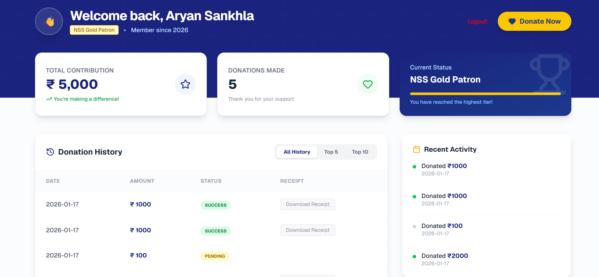
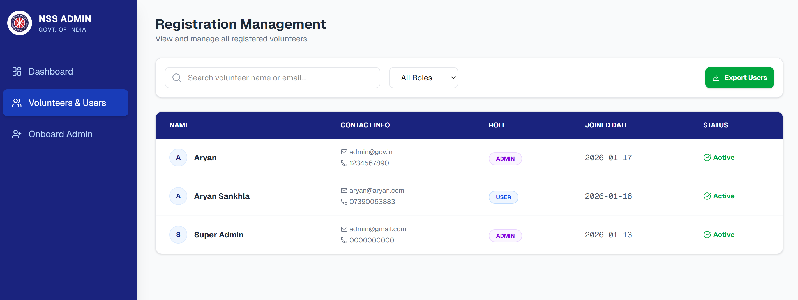

# 🇮🇳 NSS Donation & Volunteer Portal


A full-stack donation and volunteer management platform built for the **National Service Scheme (NSS)**. This application enables secure fundraising, volunteer registration, and comprehensive administrative management with real-time analytics.

🔗 **Live Demo:** [https://nss-donation-portal.vercel.app](https://nss-donation-portal.vercel.app)

---

## 🚀 Key Features

### 👤 User Panel (Volunteers/Donors)
* **Secure Authentication:** Sign up and Login with secure session management (JWT).
* **Donation System:** Integrated **Razorpay Payment Gateway** for seamless contributions.
* **Dynamic Dashboard:** Real-time progress bars, donation history, and badge system (Bronze/Silver/Gold).
* **Instant Receipts:** Auto-generated digital receipts for every donation.

### 🛡️ Admin Panel (Government/Officials)
* **Financial Overview:** Track total funds, active donors, and pending transactions in real-time.
* **User Management:** View, search, and filter all registered volunteers and admins.
* **Data Export:** One-click **CSV Export** for both Donation Records and Volunteer Data.
* **Secure Onboarding:** Special interface to onboard new Admins using a Master Security Key.
* **Role-Based Access:** Middleware protection ensures only authorized personnel access sensitive data.

---

## 🛠️ Tech Stack

| Category | Technologies |
| :--- | :--- |
| **Frontend** | Next.js 14 (App Router), React, Tailwind CSS, Lucide Icons |
| **Backend** | Next.js Server Actions, Node.js |
| **Database** | MongoDB Atlas (Mongoose ORM) |
| **Authentication** | JWT (JSON Web Tokens), JOSE, Bcrypt.js |
| **Payments** | Razorpay Payment Gateway API |
| **Deployment** | Vercel |

---

## 📸 Screenshots

### 1. Admin Dashboard (Financial Overview)

*(Manage funds, view real-time stats, and track recent transactions)*

### 2. User Dashboard & Gamification

*(Dynamic progress bars, donation history, and impact tracking)*

### 3. Volunteer Management & Export

*(Filter users by role, search by name, and export data to CSV)*

---

## ⚡ Getting Started (Local Setup)

Follow these steps to run the project locally on your machine.

### 1. Clone the Repository
```bash
git clone [https://github.com/YOUR_USERNAME/nss-portal.git](https://github.com/YOUR_USERNAME/nss-portal.git)
cd nss-portal
